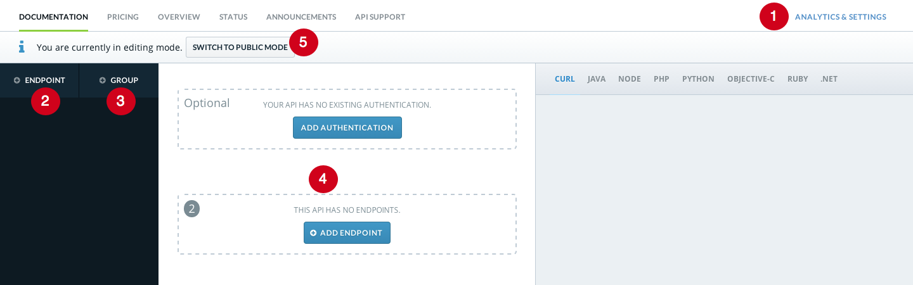

##Adding an API

The core feature of Mashape is the ability to consume APIs from the browser. To do so you need to add API on the platform.

Here's a quick overview of what you need to do to create an API

* Give it a name <strong style="color:red">(<strong style="color:white">1</strong>)</strong>
* Define Endpoints and Parameters <strong style="color:red">(<strong style="color:white">2</strong>)</strong>
* (Optional) Group endpoints <strong style="color:red">(<strong style="color:white">3</strong>)</strong>
* Define API details <strong style="color:red">(<strong style="color:white">4</strong>)</strong>
* Test Endpoint(s) <strong style="color:red">(<strong style="color:white">5</strong>)</strong>

<p class="image-center"></p>


###Name Your API
Within the Administration Panel of your API (more of this in the "API Admin" section)
You need to carefully choose an API name as this will represent you in the marketplace (in case you set the API public)
Remember not to use the word API, it's obvious you're listing one!

###Define API Details
In regards to the API details, once you created your API, you will be able to access its admin panel. 

From here you can set up:

* Your API base URL: Self-explanatory, that's the base of your API on the web (example: ```https://api.yourdomain.com/```)
* Hidden transformation parameters: To be sent to the base URL by the proxy and non-public to the end user
* API Details: You need to specify a name, description, logo for your API before going public, that'll be useful to find your API in the marketplace

###Group Endpoints
Back into the Documentation tab, before specifying endpoints of your API, it is good practice to add grouping for your of endpoints.

###Define Endpoints and Parameters
This is probably the most laborious part which requires a lot of discipline, but the results are amazing.
Once you start adding one endpoint (name, route etc) and its  associated parameters, Mashape will build the documentation of your API so that developers from all over the world can understand how to use your API.

####Don't forget to Add Authentication
Very important, else no one will be able to consume your API. Mashape supports most forms of API authentication, including OAuth2

*PRO-TIPS*

* *Don't forget to add meaningful descriptions and examples*
* *Don't forget you can switch to Developer Mode to test your endpoints*

###Test Endpoint(s)
Back into Developer mode you can test your API as a consumer would!
Don't forget to make sure everything works or you will see people opening tickets in your API Issues section ;)

